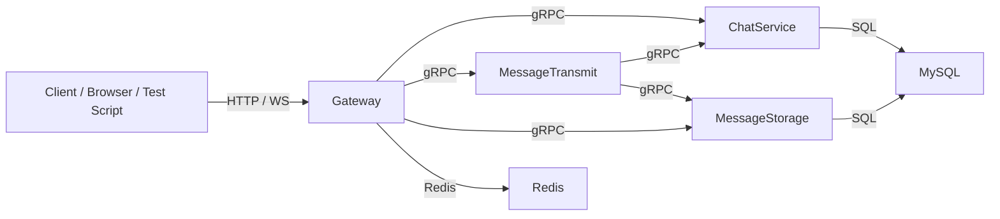
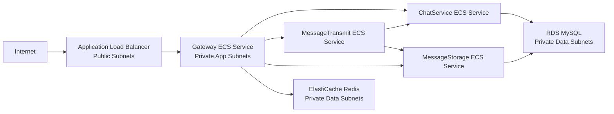

# CS6650 Final Project — Distributed Chatroom System

## 1. Project Overview

This project is a distributed chatroom backend built with Go and deployed on AWS.

It supports:
- group chat session creation
- session member management
- session list query per user
- string message sending
- recent message query
- unread message query
- mark-as-read updates
- sender auto-read after sending a message
- online status storage in Redis
- real-time push through WebSocket

The system is split into multiple services so that chat session logic, message storage, and request entry are separated.

## 1.1 Project Structure

A simplified project structure is shown below. The exact file list may grow over time, but these are the main folders and files teammates should know before using or extending the project.

```text
CS6650-Final-Project/
├── api/
│   └── gen/chatroom/v1/                 # generated protobuf Go files
├── cmd/
│   ├── gateway/                         # HTTP + WebSocket entry service
│   ├── chatservice/                     # chat session and member service
│   ├── messagestorage/                  # message persistence service
│   ├── messagetransmit/                 # message send orchestration service
│   ├── migrator/                        # optional migration task logic (if used later)
│   └── testclient/                      # simple local integration test client
├── internal/
│   ├── gateway/
│   │   ├── client/                      # gRPC clients used by gateway
│   │   └── ...
│   ├── chatservice/
│   │   └── repo/                        # MySQL repo for sessions and members
│   ├── messagestorage/
│   │   └── repo/                        # MySQL repo for messages
│   ├── messagetransmit/
│   │   └── client/                      # gRPC clients used by messagetransmit
│   ├── mysqlx/                          # MySQL connection wrapper
│   ├── redisx/                          # Redis wrapper
│   └── ...
├── migrations/                          # SQL files to initialize MySQL/RDS schema
├── terraform/
│   ├── environments/dev/                # dev environment root config
│   └── modules/                         # reusable Terraform modules
├── Dockerfile.gateway
├── Dockerfile.chatservice
├── Dockerfile.messagestorage
├── Dockerfile.messagetransmit
├── Dockerfile.migrator                  # optional one-off migration image
├── docker-compose.yml                   # local MySQL/Redis + service wiring
└── README.md
```

Quick guidance for teammates:
- if you want to add or change API behavior, start from `cmd/gateway` and the matching internal service
- if you want to change session logic, look at `cmd/chatservice` and `internal/chatservice/repo`
- if you want to change message storage/query logic, look at `cmd/messagestorage` and `internal/messagestorage/repo`
- if you want to change send-message behavior, look at `cmd/messagetransmit` and `internal/messagetransmit/client`
- if you want to change deployment, look at `terraform/environments/dev` and `terraform/modules`
- if you want to initialize the database schema, look at `migrations/`


---

## 2. Main Components

### `gateway`
The HTTP/WebSocket entry service.

Responsibilities:
- expose HTTP APIs
- accept WebSocket connections
- forward business requests to internal gRPC services
- push real-time messages to online users
- store online state in Redis

### `chatservice`
The session and membership service.

Responsibilities:
- create group chat sessions
- return a user’s session list
- return session members
- check whether a user belongs to a session
- update a member’s `last_read_seq`

### `messagestorage`
The message persistence service.

Responsibilities:
- store messages in MySQL
- return recent messages
- return unread messages
- return history messages
- return session snapshot / last message info

### `messagetransmit`
The message send orchestration service.

Responsibilities:
- verify sender membership before sending
- call `messagestorage` to persist the message
- call `chatservice` to get target member IDs
- automatically mark the sender’s own message as read

### `MySQL`
Stores business data:
- users
- relations
- chat sessions
- session members
- messages

### `Redis`
Stores runtime state such as:
- online user status
- gateway binding information
- last seen timestamp

---

## 3. High-Level Architecture



AWS deployment version:
- `gateway` is behind ALB
- internal services run on ECS/Fargate
- internal service discovery uses ECS Service Connect
- MySQL runs on RDS
- Redis runs on ElastiCache

---

## 4. Data Flow

## 4.1 Create Group Chat Session

1. Client sends `POST /api/sessions/group` to `gateway`
2. `gateway` calls `chatservice.CreateGroupChatSession`
3. `chatservice` writes:
   - `chat_sessions`
   - `chat_session_members`
4. `chatservice` returns session info and members
5. `gateway` returns JSON response to the client

---

## 4.2 Send String Message

1. Client sends `POST /api/messages/send` to `gateway`
2. `gateway` calls `messagetransmit.SendStringMessage`
3. `messagetransmit` calls `chatservice.IsSessionMember`
4. If membership check passes, `messagetransmit` calls `messagestorage.StoreStringMessage`
5. `messagestorage` inserts the message and returns a new `session_seq`
6. `messagetransmit` calls `chatservice.MarkSessionRead` for the sender using the new `session_seq`
7. `messagetransmit` calls `chatservice.ListSessionMemberIds`
8. `messagetransmit` returns:
   - stored message
   - target user IDs
9. `gateway` returns the HTTP response
10. `gateway` also pushes `new_message` over WebSocket to online users

### Important behavior
After a user sends a message, the sender is automatically marked as having read that message.

Example:
- `u2` had `last_read_seq = 3`
- `u2` sends a new message with `session_seq = 4`
- system automatically updates `u2.last_read_seq = 4`
- result: `u2.unread_count = 0`
- other users who have not read that message will still see unread messages

---

## 4.3 Get Session List

1. Client sends `GET /api/sessions?user_id=...`
2. `gateway` calls `chatservice.GetChatSessionList`
3. `chatservice` returns session summary including:
   - session info
   - `last_read_seq`
   - `unread_count`
4. `gateway` returns JSON response

---

## 4.4 Get Recent / Unread Messages

1. Client sends request to `gateway`
2. `gateway` calls `messagestorage`
3. `messagestorage` queries MySQL
4. `gateway` returns JSON response

---

## 5. Database Tables

Current schema is based on these logical tables:
- `users`
- `relations`
- `chat_sessions`
- `chat_session_members`
- `messages`

Typical responsibilities:
- `chat_sessions`: one row per chat session
- `chat_session_members`: one row per user per session, including `last_read_seq`
- `messages`: one row per message, including `session_seq`

---

## 6. Exposed APIs

## 6.1 Health Check

### `GET /health`
Checks whether `gateway` is alive.

Example:
```bash
curl http://<ALB_OR_GATEWAY>/health
```

Expected response:
```json
{"status":"ok"}
```

---

## 6.2 Create Group Chat Session

### `POST /api/sessions/group`

Request body:
```json
{
  "creator_id": "u1",
  "name": "demo-group",
  "member_ids": ["u1", "u2", "u3"]
}
```

Example:
```bash
curl -X POST "http://<ALB_OR_GATEWAY>/api/sessions/group" \
  -H "Content-Type: application/json" \
  -d '{
    "creator_id": "u1",
    "name": "demo-group",
    "member_ids": ["u1", "u2", "u3"]
  }'
```

Response contains:
- created session
- all session members

---

## 6.3 Get Session List

### `GET /api/sessions?user_id=<USER_ID>`

Example:
```bash
curl "http://<ALB_OR_GATEWAY>/api/sessions?user_id=u1"
```

Response contains:
- session info
- `last_read_seq`
- `unread_count`

---

## 6.4 Send String Message

### `POST /api/messages/send`

Request body:
```json
{
  "sender_id": "u1",
  "session_id": "s_xxx",
  "content": "hello"
}
```

Example:
```bash
curl -X POST "http://<ALB_OR_GATEWAY>/api/messages/send" \
  -H "Content-Type: application/json" \
  -d '{
    "sender_id": "u1",
    "session_id": "s_xxx",
    "content": "hello"
  }'
```

Response contains:
- stored message
- `target_user_ids`

---

## 6.5 Get Session Members

### `GET /api/sessions/<SESSION_ID>/members`

Example:
```bash
curl "http://<ALB_OR_GATEWAY>/api/sessions/s_xxx/members"
```

---

## 6.6 Get Recent Messages

### `GET /api/sessions/<SESSION_ID>/messages/recent?limit=20`

Example:
```bash
curl "http://<ALB_OR_GATEWAY>/api/sessions/s_xxx/messages/recent?limit=20"
```

---

## 6.7 Get Unread Messages

### `GET /api/sessions/<SESSION_ID>/messages/unread?after_seq=0&limit=20`

Example:
```bash
curl "http://<ALB_OR_GATEWAY>/api/sessions/s_xxx/messages/unread?after_seq=0&limit=20"
```

---

## 6.8 Mark Session as Read

### `POST /api/sessions/<SESSION_ID>/read`

Request body:
```json
{
  "user_id": "u1",
  "last_read_seq": 2
}
```

Example:
```bash
curl -X POST "http://<ALB_OR_GATEWAY>/api/sessions/s_xxx/read" \
  -H "Content-Type: application/json" \
  -d '{
    "user_id": "u1",
    "last_read_seq": 2
  }'
```

---

## 6.9 WebSocket

### `GET /ws`
WebSocket endpoint for online push.

Expected client flow:
1. connect to `/ws`
2. send auth payload
3. receive `auth_ok`
4. wait for `new_message`

Example auth message:
```json
{
  "type": "auth",
  "user_id": "u2"
}
```

Example push payload:
```json
{
  "type": "new_message",
  "session_id": "s_xxx",
  "message": {
    "message_id": "m_xxx",
    "session_id": "s_xxx",
    "session_seq": 4,
    "sender_id": "u2",
    "content": "auto read test from u2"
  }
}
```

---

## 7. Local Development

## 7.1 Start infrastructure

```bash
docker compose up -d mysql redis
```

## 7.2 Start services locally

In separate terminals:

### chatservice
```bash
go run ./cmd/chatservice
```

### messagestorage
```bash
go run ./cmd/messagestorage
```

### messagetransmit
```bash
CHATSERVICE_TARGET=127.0.0.1:50051 \
MESSAGESTORAGE_TARGET=127.0.0.1:50052 \
go run ./cmd/messagetransmit
```

### gateway
```bash
CHATSERVICE_TARGET=127.0.0.1:50051 \
MESSAGESTORAGE_TARGET=127.0.0.1:50052 \
MESSAGETRANSMIT_TARGET=127.0.0.1:50053 \
REDIS_ADDR=127.0.0.1:6379 \
go run ./cmd/gateway
```

Local gateway address:
```text
http://127.0.0.1:8080
```

---

## 8. AWS Deployment Notes

Current AWS deployment style:
- ALB in front of `gateway`
- ECS/Fargate for all 4 services
- Service Connect for internal service discovery
- RDS MySQL
- ElastiCache Redis

After deployment, the main entry is:
```text
http://<ALB_DNS_NAME>
```

Example health check:
```bash
curl http://<ALB_DNS_NAME>/health
```

## 8.0 Current Dev Terraform Output Reference

The following values are from the current `terraform output` of the dev environment. Teammates can use these values directly when testing the AWS deployment.

```text
alb_dns_name = "chatroom-dev-alb-1901196816.us-west-2.elb.amazonaws.com"
alb_security_group_id = "sg-085c83c47e564b649"
chatservice_service_name = "chatroom-dev-chatservice"
ecr_repository_urls = {
  "chatservice" = "627195602448.dkr.ecr.us-west-2.amazonaws.com/chatroom-dev-chatservice"
  "gateway" = "627195602448.dkr.ecr.us-west-2.amazonaws.com/chatroom-dev-gateway"
  "messagestorage" = "627195602448.dkr.ecr.us-west-2.amazonaws.com/chatroom-dev-messagestorage"
  "messagetransmit" = "627195602448.dkr.ecr.us-west-2.amazonaws.com/chatroom-dev-messagetransmit"
}
ecs_cluster_arn = "arn:aws:ecs:us-west-2:627195602448:cluster/chatroom-dev-cluster"
ecs_cluster_name = "chatroom-dev-cluster"
ecs_task_execution_role_arn = "arn:aws:iam::627195602448:role/chatroom-dev-ecs-task-execution-role"
ecs_task_role_arn = "arn:aws:iam::627195602448:role/chatroom-dev-ecs-task-role"
gateway_security_group_id = "sg-026f7bc4eb17e987e"
gateway_service_name = "chatroom-dev-gateway"
gateway_target_group_arn = "arn:aws:elasticloadbalancing:us-west-2:627195602448:targetgroup/chatroom-dev-gw-tg/fb2e5f13f9bde85e"
internal_service_security_group_id = "sg-0a3ef31ae0cb8c752"
log_group_names = {
  "chatservice" = "/ecs/chatroom/dev/chatservice"
  "gateway" = "/ecs/chatroom/dev/gateway"
  "messagestorage" = "/ecs/chatroom/dev/messagestorage"
  "messagetransmit" = "/ecs/chatroom/dev/messagetransmit"
}
messagestorage_service_name = "chatroom-dev-messagestorage"
messagetransmit_service_name = "chatroom-dev-messagetransmit"
private_app_subnet_ids = [
  "subnet-08110049309e3307b",
  "subnet-0081ba352639cdbfa",
]
private_data_subnet_ids = [
  "subnet-015389661db57f2cc",
  "subnet-062b88464e9d321b8",
]
public_subnet_ids = [
  "subnet-0546e861e4c3a19ac",
  "subnet-0d942ff12c34f1da9",
]
rds_endpoint = "chatroom-dev-mysql.cjias2iok297.us-west-2.rds.amazonaws.com"
rds_port = 3306
rds_security_group_id = "sg-008a9a084f1dbb42e"
redis_port = 6379
redis_primary_endpoint = "chatroom-dev-redis.yocw1g.ng.0001.usw2.cache.amazonaws.com"
redis_security_group_id = "sg-0424e934b7eeaa197"
service_connect_namespace_arn = "arn:aws:servicediscovery:us-west-2:627195602448:namespace/ns-2shfoag4q5qok3p2"
vpc_id = "vpc-02055d47f36dd9d2e"
```

### Most useful values for daily testing
- ALB entry:
  - `chatroom-dev-alb-1901196816.us-west-2.elb.amazonaws.com`
- ECS cluster:
  - `chatroom-dev-cluster`
- RDS endpoint:
  - `chatroom-dev-mysql.cjias2iok297.us-west-2.rds.amazonaws.com`
- Redis endpoint:
  - `chatroom-dev-redis.yocw1g.ng.0001.usw2.cache.amazonaws.com`
- CloudWatch log groups:
  - `/ecs/chatroom/dev/gateway`
  - `/ecs/chatroom/dev/chatservice`
  - `/ecs/chatroom/dev/messagestorage`
  - `/ecs/chatroom/dev/messagetransmit`

### Example using current ALB directly
```bash
curl http://chatroom-dev-alb-1901196816.us-west-2.elb.amazonaws.com/health
```

## 8.1 AWS Network Structure

The AWS deployment uses a layered VPC design.

### Network layout
- **1 VPC** for the whole environment
- **2 public subnets**
  - used by the Application Load Balancer
  - each public subnet has route access to the Internet Gateway
- **2 private app subnets**
  - used by ECS/Fargate services:
    - gateway
    - chatservice
    - messagestorage
    - messagetransmit
- **2 private data subnets**
  - used by:
    - RDS MySQL
    - ElastiCache Redis
- **Internet Gateway**
  - attached to the VPC
- **NAT Gateways**
  - used so private services can pull images / reach required outbound AWS endpoints without being directly public

### Traffic flow
1. Client requests enter through **ALB** in the public subnets
2. ALB forwards traffic to **gateway** tasks in private app subnets
3. `gateway` talks to internal ECS services through **ECS Service Connect**
4. `chatservice` and `messagestorage` talk to **RDS MySQL** in private data subnets
5. `gateway` talks to **Redis / ElastiCache** for online status

### Security group intent
- **ALB security group**
  - allows public HTTP/HTTPS ingress
- **gateway security group**
  - allows traffic only from ALB on the gateway port
- **internal service security group**
  - allows internal gRPC service-to-service traffic
- **RDS security group**
  - allows MySQL access only from internal services
- **Redis security group**
  - allows Redis access only from gateway

### Simplified AWS network diagram



This structure means only ALB is public. The application services and databases are not directly exposed to the Internet.

---

## 9. Example End-to-End Test Flow

This is the recommended manual test flow.

### Step 1. Create a group session
```bash
curl -X POST "http://<ALB_OR_GATEWAY>/api/sessions/group" \
  -H "Content-Type: application/json" \
  -d '{
    "creator_id": "u1",
    "name": "demo-group",
    "member_ids": ["u1", "u2", "u3"]
  }'
```

Save the returned `session_id`.

### Step 2. Check session list for `u1`
```bash
curl "http://<ALB_OR_GATEWAY>/api/sessions?user_id=u1"
```

### Step 3. Send a message from `u1`
```bash
curl -X POST "http://<ALB_OR_GATEWAY>/api/messages/send" \
  -H "Content-Type: application/json" \
  -d '{
    "sender_id": "u1",
    "session_id": "<SESSION_ID>",
    "content": "hello from aws"
  }'
```

### Step 4. Query recent messages
```bash
curl "http://<ALB_OR_GATEWAY>/api/sessions/<SESSION_ID>/messages/recent?limit=20"
```

### Step 5. Query unread messages
```bash
curl "http://<ALB_OR_GATEWAY>/api/sessions/<SESSION_ID>/messages/unread?after_seq=0&limit=20"
```

### Step 6. Mark read
```bash
curl -X POST "http://<ALB_OR_GATEWAY>/api/sessions/<SESSION_ID>/read" \
  -H "Content-Type: application/json" \
  -d '{
    "user_id": "u1",
    "last_read_seq": 1
  }'
```

### Step 7. Verify sender auto-read behavior
1. mark all members to current latest seq
2. let `u2` send a new message
3. check that:
   - `u2.last_read_seq == last_seq`
   - `u2.unread_count == 0`
   - other users’ unread counts increase

---

## 10. Load Test Guidance

This section is for teammates who need to run load tests.

## 10.1 Recommended target
Use the ALB URL as the load test target:

```text
http://<ALB_DNS_NAME>
```

Do **not** target internal ECS service addresses directly.

---

## 10.2 Good load test candidates
The safest endpoints to load test first are:

### A. Health check
```text
GET /health
```
Purpose:
- verify ALB and gateway stability
- very low risk

### B. Session list query
```text
GET /api/sessions?user_id=u1
```
Purpose:
- light read workload
- good first functional load test

### C. Recent messages query
```text
GET /api/sessions/<SESSION_ID>/messages/recent?limit=20
```
Purpose:
- read-heavy workload against message storage

### D. Send string message
```text
POST /api/messages/send
```
Purpose:
- write path test
- exercises gateway, messagetransmit, chatservice, messagestorage, and MySQL

---

## 10.3 Recommended load test progression

### Phase 1: Smoke test
- 1–5 users
- low request rate
- confirm no functional failures

### Phase 2: Read-heavy test
- focus on:
  - `/api/sessions`
  - `/messages/recent`
- collect latency and error rate

### Phase 3: Mixed chat workload
Use a mix such as:
- 70% read APIs
- 30% send message API

Suggested mix:
- 35% `GET /api/sessions`
- 35% `GET /messages/recent`
- 30% `POST /api/messages/send`

### Phase 4: Write-heavy stress
Focus on:
- `POST /api/messages/send`
- observe:
  - latency
  - 5xx errors
  - ECS task restarts
  - RDS bottlenecks

---

## 10.4 Notes for load testing
- use existing valid `session_id` values
- use valid users that belong to the session
- if testing send-message heavily, create several sessions first
- avoid destroying data during active tests
- watch CloudWatch logs while testing
- monitor ECS service stability and ALB health

---

## 10.5 Suggested metrics to record
- request rate
- average latency
- p95 / p99 latency
- error rate
- ECS task CPU / memory
- RDS CPU / connections
- ALB target health

---

## 10.6 Example load test ideas

### Read test
- repeatedly query:
  - `/api/sessions?user_id=u1`
  - `/api/sessions/<SESSION_ID>/messages/recent?limit=20`

### Write test
- repeatedly send messages using a few valid users in the same session
- verify sequence numbers continue increasing

### Mixed test
- combine reads and writes in one script
- verify no sudden spike in 500 errors

---

## 11. Troubleshooting

### Error: `failed to create group session`
Likely causes:
- chatservice cannot reach MySQL
- database tables not initialized
- RDS credentials/security group issue

### Error: `failed to send message`
Likely causes:
- sender is not a session member
- messagetransmit cannot reach chatservice or messagestorage
- message table missing or DB write failed

### Error: `lookup chatservice ... no such host`
Likely causes:
- ECS Service Connect not configured correctly
- old ECS tasks still running without latest Service Connect deployment

### ALB health check fails
Likely causes:
- gateway container not healthy
- target group path mismatch
- security group rules incorrect

---

## 12. Current Verified Behaviors

The following behaviors have already been verified in this project:
- health check through ALB
- create group chat session
- session list query for multiple users
- send string message
- recent message query
- unread message query
- mark read
- session sequence increment across multiple messages
- sender auto-read after sending

---

## 12.1 Current Known Limitation / Bug

### Direct Message / 1v1 is not fully implemented
This project currently focuses on **group chat** as the main verified feature set.

A full direct-message (1v1) workflow is **not fully implemented yet**.

Current limitation details:
- there is **no dedicated direct-session create API** such as `POST /api/sessions/direct`
- there is **no database-level direct-session uniqueness rule** to guarantee that a user pair such as `u1-u2` only maps to one direct session
- there is **no finalized direct session display-name logic** (for example, showing the peer user’s nickname)
- there is **no finalized rule to check `relations` first before creating a direct session**

### Why this matters
Because of these missing pieces, if teammates try to extend the current codebase into 1v1 chat without adding extra constraints, the following bug may happen:

- `u1` starts a chat with `u2`
- later `u2` also starts a chat with `u1`
- the system may create **two separate direct sessions** instead of reusing one shared direct-message window

### Current recommendation
For now, teammates should treat this project as:
- **group-chat verified**
- **1v1 not production-complete yet**

If direct message support is added later, the recommended fix is:
- add a dedicated direct-session API
- generate a normalized pair key such as `min(u1,u2):max(u1,u2)`
- store that key in the database
- add a unique constraint for direct sessions
- use a get-or-create flow in `chatservice`

## 13. Suggested Next Work

Potential future improvements:
- authentication / token validation
- persistence and fanout improvements for WebSocket push
- multi-instance online push coordination
- structured metrics endpoint
- automated migration job in Terraform
- Secrets Manager for DB password
- CI/CD pipeline for image build and deployment

