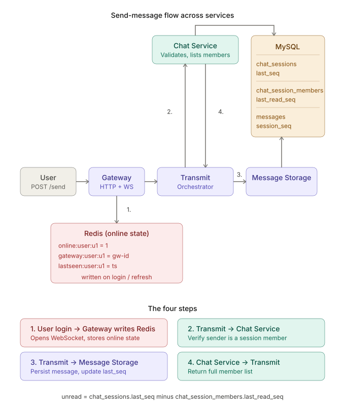
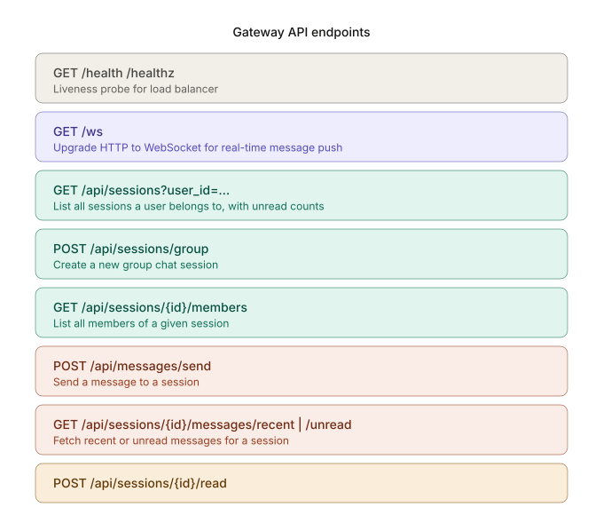

# Project Management — Distributed Chatroom

**Authors:** Liecheng Jiang, Shiyuan Xu, Hui Luo

From initial design to final deployment: how we broke the problem down, how work was divided, and the problems we encountered along the way.

---

## Project Overview

This project is a distributed chatroom system with three major deliverables:

1. **Code** — the backend services written in Go, communicating via gRPC, persisting to MySQL, and tracking online state in Redis.
2. **Terraform** — infrastructure-as-code to deploy the system on AWS ECS with Service Connect, RDS MySQL, ElastiCache Redis, and an Application Load Balancer.
3. **Experiment** — load testing and performance evaluation of the deployed system. *(See the separate Experiment Report for details.)*

The sections below walk through how the code and deployment parts evolved.

---

## Part 1 — Code

This was the largest part of the project. We were responsible for the backend implementation end-to-end.

### Step 1 — Database schema design

Before writing any Go code, we spent time designing the MySQL schema. This turned out to be the single most important decision of the whole project, because:

- **Messages need to be durable.** No matter what happens to the network or the Gateway, once a message is accepted, it must not be lost.
- **The schema shapes the API.** Every RPC call ultimately becomes a SQL query, so a clean schema makes the service code clean too.

We ended up with five tables:

- `users` — user identity (user_id, nickname, avatar_url)
- `relations` — friend relationships
- `chat_sessions` — both direct and group sessions, with a `last_seq` counter
- `chat_session_members` — session membership with `last_read_seq` per user, used to compute unread counts
- `messages` — one row per message, with a monotonically increasing `session_seq` scoped to the session

The key design here is the `session_seq` field. Each session maintains its own counter, and every new message gets `last_seq + 1`. This is allocated inside a MySQL transaction that touches both `messages` and `chat_sessions`, which guarantees no two messages in the same session ever get the same sequence number — even under concurrent sends.

Unread detection becomes trivial: `unread_count = chat_sessions.last_seq - chat_session_members.last_read_seq`.

### Step 2 — Define the service contract with protobuf

With the schema in place, the next step was deciding how the services would talk to each other. Since we chose a microservice architecture with four separate services, we needed a clear, typed, language-neutral way to describe every RPC call.

We used **protobuf** to define the message shapes and **gRPC** as the transport. The proto files became the single source of truth — every service reads from them, so nobody can accidentally send a field the other side doesn't understand. `protoc` auto-generates the Go client and server stubs, so adding a new RPC only requires changing the `.proto` file and rerunning the generator.

This was critical because in a distributed system, the hardest bugs come from mismatched assumptions between services. Protobuf makes those assumptions explicit.

### Step 3 — Organize the code: `internal/` vs `cmd/`

Before writing any service, we settled on a layout that separates two very different concerns:

- `internal/<service>/` — the **domain logic**: how to talk to MySQL, how to build a session, what a repository looks like. This code doesn't know anything about gRPC or HTTP.
- `cmd/<service>/main.go` — the **process entry point**: reads environment variables, opens connections, starts the gRPC server, wires handlers to the underlying repository.

**Why separate them?** Three reasons:

1. **Testability.** The code in `internal/` doesn't depend on network or protocol. We can unit-test a repository function by passing it a fake database, without starting a real gRPC server.
2. **Single responsibility.** `main.go` is allowed to be messy — it's glue code for the real world (env vars, ports, TLS, signal handling). The business logic in `internal/` stays clean.
3. **Reusability.** If we ever want to run the same repository logic from a CLI, a migration script, or a different RPC framework, we don't have to rewrite it.

Every service in this project follows this shape.

### Step 4 — Build the data-owning services first (Chat Service, Message Storage)

We started with the two services that actually own data, because everything else depends on them.

**Chat Service** manages sessions, members, and read state. Its `internal/chatservice/repo/` package wraps all the SQL: `CreateChatSession`, `ListSessionMembers`, `IsSessionMember`, `MarkSessionRead`, and so on. Its `cmd/chatservice/main.go` opens a MySQL connection pool, instantiates the repository, and registers the gRPC handlers.

**Message Storage** owns message persistence. Its repository handles the critical `StoreStringMessage` operation — a single transaction that inserts the message and updates `chat_sessions.last_seq` atomically. Its `main.go` follows the same shape as Chat Service.

Writing these first meant that every downstream service had a stable, tested foundation to build on.

### Step 5 — Build the orchestrator (Message Transmit)

Message Transmit is stateless — it owns no data of its own. Its job is to **coordinate** Chat Service and Message Storage to satisfy a single high-level intent: "send a message."

Its `internal/messagetransmit/client/` package contains gRPC client wrappers for Chat Service and Message Storage. These wrappers add timeout context, retry behavior, and clean Go signatures that hide the proto details from the orchestrator logic.

Its `cmd/messagetransmit/main.go` reads the target addresses from environment variables (`CHATSERVICE_TARGET`, `MESSAGESTORAGE_TARGET`), dials both dependencies, and exposes its own gRPC API — specifically `SendStringMessage`.

When a `SendStringMessage` request arrives, Transmit does four things in sequence:

1. Calls Chat Service to verify the sender is a session member.
2. Calls Message Storage to persist the message (this is where the atomic seq allocation happens).
3. Calls Chat Service again to get the full list of session members.
4. Returns the saved message plus the member list back to the caller.

Note that Transmit never touches MySQL directly — that's a deliberate boundary. Only Chat Service and Message Storage know about the database.

The full send-message flow is shown below:



### Step 6 — Build the entry point (Gateway)

Gateway is the only service that talks to the outside world. It speaks HTTP and WebSocket to clients, and gRPC to everything inside.

Following the same pattern, we split it into:

- `internal/gateway/client/` — gRPC client wrappers for Chat Service, Message Storage, and Message Transmit. These are nearly identical to the ones in Transmit, so they're a candidate for future deduplication, but keeping them separate for now keeps the two services independently deployable.
- `cmd/gateway/main.go` — the HTTP router, the JSON encoding/decoding logic, the WebSocket connection manager, and the Redis online-state writes.

The HTTP layer exposes the following endpoints:



| Endpoint | Method | Purpose |
|---|---|---|
| `/ws` | GET | Upgrade to WebSocket for real-time push |
| `/api/sessions` | GET | List a user's sessions with unread counts |
| `/api/sessions/group` | POST | Create a new group chat |
| `/api/sessions/{id}/members` | GET | List members of a session |
| `/api/sessions/{id}/messages/recent` | GET | Fetch recent messages |
| `/api/sessions/{id}/messages/unread` | GET | Fetch unread messages |
| `/api/sessions/{id}/read` | POST | Mark a session as read |
| `/api/messages/send` | POST | Send a message to a session |
| `/health`, `/healthz` | GET | Liveness probes for the load balancer |

When a user connects via WebSocket, Gateway writes three keys to Redis: `online:user:<id>`, `gateway:user:<id>`, and `lastseen:user:<id>`. These serve as shared online state for future multi-instance deployments.

### Why this order mattered

Building bottom-up — schema → protobuf → data services → orchestrator → gateway — meant that at every step we could test the layer we just finished against a real, working layer below it. If we had started at the top and worked down, we would have been writing handlers against mocks for weeks, and discovering schema problems only after the rest of the code was already committed.

---

## Part 2 — Terraform Infrastructure

Once the code was running in Docker Compose locally, we turned to AWS deployment using Terraform.

The infrastructure is modular: separate modules for the VPC, security groups, ECR, CloudWatch Logs, IAM, ALB, ECS cluster, ECS services, RDS MySQL, and ElastiCache Redis. The environment-specific `dev/main.tf` wires them all together. Every ECS service runs on Fargate with `desired_count = 1` and joins a shared AWS Service Connect namespace, so services can discover each other by name (e.g. Gateway connects to `chatservice:50051`).

### The Service Connect problem

The most interesting issue we hit was with **AWS Service Connect**. After `terraform apply` completed successfully, we tried calling the API:

```
curl -X POST http://<alb>/api/sessions/group ...
{"error":"failed to create group session"}
```

The CloudWatch logs for Gateway showed the real cause:

```
CreateGroupChatSession error: rpc error: code = Unavailable
transport: Error while dialing: dial tcp:
lookup chatservice on 10.10.0.2:53: no such host
```

DNS resolution for `chatservice` was failing. Checking the ECS services directly:

```
aws ecs describe-services ...
  --query 'services[].serviceConnectConfiguration'

[ null, null, null, null ]
```

All four services reported their Service Connect config as `null`, even though Terraform had successfully applied the configuration.

**The fix** was to force-replace all four ECS services:

```
terraform apply \
  -replace='module.chatservice_service.aws_ecs_service.this' \
  -replace='module.messagestorage_service.aws_ecs_service.this' \
  -replace='module.messagetransmit_service.aws_ecs_service.this' \
  -replace='module.gateway_service.aws_ecs_service.this' \
  -auto-approve
```

After this, Service Connect registered correctly and DNS resolution worked.

**What we think was happening.** Service Connect registration requires two things to line up: the Service Connect namespace must be fully propagated in AWS Cloud Map, and each ECS task must successfully register with the Envoy sidecar AWS injects at startup. When Terraform created everything in one pass, there was a race: the ECS tasks started before the namespace was fully ready, so their first registration attempt silently failed. On subsequent applies, Terraform didn't see any "change" that required restarting the tasks — so nothing ever triggered a re-registration. Destroying and recreating the services forced fresh tasks to start against a now-stable namespace, which is why the fix worked.

This was a good lesson in how "`terraform apply` succeeded" is not the same as "the system is actually working." Distributed systems often have eventual-consistency quirks that the Terraform state doesn't capture.

---

## Part 3 — Experiment

We ran load tests and measured the performance of the deployed system. **See the separate Experiment Report for the full setup, results, and observations.**

---

## Problem Log

A summary of the main obstacles encountered and how they were resolved.

| Problem | Where | Resolution |
|---|---|---|
| Designing a schema that supports atomic seq allocation | Database design | Put `last_seq` in `chat_sessions` and update it in the same transaction as the message insert |
| Coupling between HTTP handlers and gRPC calls made code hard to test | Gateway and Transmit | Split into `internal/` (logic) and `cmd/main.go` (entry point) |
| `terraform apply` succeeded but services couldn't find each other | AWS deployment | Force-replaced all four ECS services to trigger fresh Service Connect registration |
| Same Go code needed to run locally, in Docker Compose, and on AWS | Cross-environment | Made all service targets configurable via environment variables — same binary, different addresses |

---

## Retrospective

**What worked well:**

- Designing the schema first made every downstream decision easier.
- The `internal/` vs `cmd/` split kept the code testable and easy to reason about.
- Using environment variables for all service targets meant the exact same binary runs on a laptop, in Docker Compose, and on AWS.

**What we would do differently:**

- **Find a cleaner way to avoid the Service Connect race.** Right now we only fix the problem reactively — when `serviceConnectConfiguration` comes back `null`, we force-replace all four services. Next time we would build the workaround into the deploy flow itself: add a `time_sleep` resource between creating the Cloud Map namespace and creating the ECS services so the namespace has time to fully propagate, set `force_new_deployment = true` on every ECS service so each apply triggers a fresh registration against a now-stable namespace, and add a post-apply verification script that actually calls the API and confirms DNS resolution before declaring the deploy done. That way the race is prevented structurally, not patched afterwards.
- **Add a `/api/sessions/direct` endpoint.** Our Gateway currently only exposes `/api/sessions/group` — there is no corresponding endpoint for one-on-one conversations. The underlying database schema already supports it (`chat_sessions.type` can be `'direct'`), but we never finished the API surface or the service logic. Direct sessions are actually trickier than group sessions for three reasons: they need **find-or-create** semantics (A+B should always resolve to the same session, regardless of who initiates), the `name` field has no natural value (the frontend needs to display the *other* person's name from the current user's perspective), and **argument order has to be normalized** so `CreateDirectSession(A, B)` and `CreateDirectSession(B, A)` produce the same session. Next time we would design the direct-session path first and treat the group path as a specialization, not the other way around.
- **Batch the MySQL queries in Chat Service and Message Storage.** Our current data access layer is correct but not efficient — many paths that logically represent "one operation" actually issue N separate round trips to MySQL. Two concrete examples from our code: Message Storage's `BatchGetSessionSnapshots` runs a single `WHERE session_id IN (...)` for the seq numbers but then loops over each session and calls `GetSessionLastMessage` one at a time — that's the classic N+1 query pattern. Chat Service's `CreateGroupChatSession` similarly runs a separate `INSERT` for every single member inside the transaction instead of one multi-row `INSERT`. At low load this is invisible; at scale it directly caps our successful message send rate per second. Next time we would rewrite these hot paths to use multi-row inserts, `JOIN`-based batch reads, and parallel fan-out with `errgroup` where appropriate — and quantify the throughput gain in the experiment phase.
